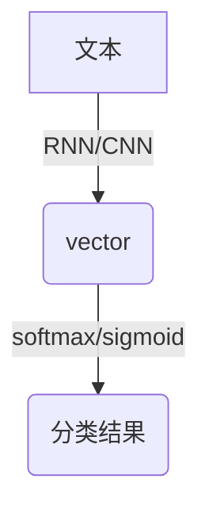
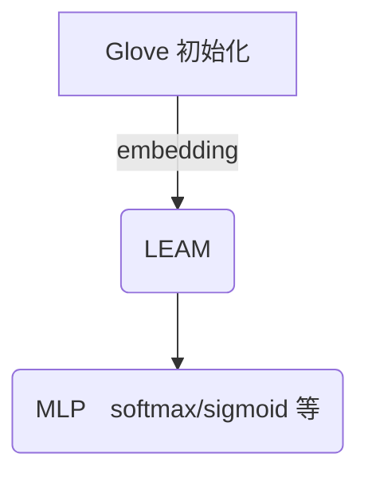
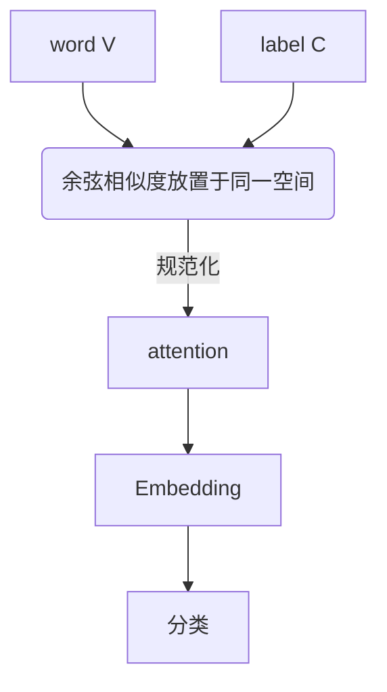

# textClassification

[TOC]

# 文本分类流程

tips: 首先一切的一切最开始都要进行数据清洗！！！

传统的文本分类工作主要分为三个过程：
1. 特征工程：bag-of-words、tf-idf等；
2. 特征选择：特征选择旨在删除噪声特征，提高分类性能。最常见的特征选择方法比如去停词(例如，“The”)、信息增益、互信息或L1正则化等以选择有用的特性；
3. 不同分类机器学习算法：逻辑回归(LR)、朴素贝叶斯(NB)和支持向量机(SVM)等。

深度学习文本分类
1. 预训练word embedding
2. 深层神经网络



# 传统文本分类模型

# 基于神经网络的文本分类模型
## CNN/RNN
###  浅层神经网络
#### 2016-NN+NBSVM

研究背景：神经模型的研究有两条线。第一种是顺序/语法感知模型，例如卷积神经网络（CNNs）、循环神经网络（RNNs）和递归神经网络（RecNNs）。在这些模型中，首先将单词嵌入到低维实向量（单词嵌入）中作为输入，然后通过神经网络学习单词的顺序/句法感知组合。另一条线是神经词袋模型，通过单词嵌入学习无序的合成（Iyyer等人，2015）。最简单的单词神经包模型是单词嵌入平均值。与顺序/语法感知模型相比，它们在训练方面效率更高，但由于忽略了顺序/语法信息而失去了准确性。

**softmax/logistic回归都属于NN，只不过只有一层**

[NBOW (Neural Bag-of-Words) 模型](https://www.zhihu.com/question/299549788/answer/865021864)

创新点：利用NB对N-grams实现加权，实现可变token，然后再利用softmax进行分类；将NBSVM拓展提出了一种将n元图和朴素贝叶斯加权引入神经词袋模型的框架。

研究意义：模型继承了单词袋表示的效率和鲁棒性，与深层神经模型相比，只需要很少的计算资源，同时在一系列数据集上表现良好，而没有特定的超参数调整。

#### 2017-fast Text
研究背景：
1. 基于**深度学习**的文本分类模型:
    1. 优点：效果好，一般能达到了目前最好的分类效果；不用做特征工程，模型简洁
    2. 缺点：速度太慢，无法在大规模的文本分类任务上使用
2. 基于**机器学习**的文本分类模型：
    1. 优点：速度一般都很快，因为模型都是线性分类器，所以比较简单；效果还可以，在某些任务上也能取得最好的效果
    2. 缺点：需要做特征工程，分类效果依赖于有效特征的选取

研究动机：
受word2vec的启发。Fasttext提出的是句子特征，CBOW提出的是上下文特征。 Fasttext需要标注语料，是监督学习，CBOW不需要标注语料，是无监督学习。实验表明，**通过合并额外的统计数据，例如使用n-gram包，可以缩小线性模型和深度模型之间的精度差距**，同时提高速度。word2vec是一个浅层神经网络。

本质：
**综合深度学和机器学习的文本分类模型的优点，达到速度快、效果好、自动特征工程**。模型的前半部分，即从输入层输入到隐含层输出部分，主要在做一件事情：生成用来表征文档的向量（将句子中的每个词先通过一个lookup层映射成词向量，然后对词向量取平均作为真个句子的句子向量，）。是一种简单有效的文本分类与表示学习方法！**结合n-gram的文本表征+分层softmax多类别分类器**

核心思想：
将整篇文档的词及n-gram向量叠加平均得到文档向量，然后使用文档向量做softmax多分类。这中间涉及到两个技巧：**字符级n-gram特征的引入**以及**分层Softmax分类**：fastText在输入时，词向量+将单词的字符级别的n-gram向量作为额外的特征；在输出时，fastText采用了分层Softmax，大大降低了模型训练时间

> 创新点：
> 1. 为文本分类任务提出了一种简单并且高效的基准模型。
> 2. Fasttext模型在精度上和基于深度学习的分类器平分秋色，但是在训练和测试速度上Fasttext快上几个数量级。
> 3. 提出了一些加快文本分类和使得文本分类效果更好的技巧——层次softmax和n-gram 特征。 

研究意义：
1. 提出了一种新的文本分类方法——Fasttext，能够进行快速的文本分类，并且效果很好。
2. 提出了一种新的使用子词的词向量训练方法——Fasttext，能够一定程度上解决OOV问题。

存在不足：

### 深度神经网络
#### 2014-Text CNN--word2vec+CNN+微调
<Convolutional Neural Networks for Sentence Classification>
##### [CNN详解](https://zhuanlan.zhihu.com/p/77634533?from_voters_page=true)

##### [卷积神经网络CNN在自然语言处理中的应用](https://www.cnblogs.com/yelbosh/p/5808706.html)

句子级分类任务

> 创新点：一个简单的CNN只需很少的超参数调整和静态向量就可以在多个基准测试中获得出色的结果。通过微调学习任务特定向量可以进一步提高性能。
>1. 提出了基于CNN的文本分类模型TextCNN
>2. 提出了多种词向量设置方式 
>3. 在四个文本分类任务上取得最优的结果
>4. 对超参进行大量实验和分析


>TextCNN历史意义：
>1. 开启了基于深度学习的文本分类的序幕
>2. 推动了卷积神经网络在自然语言处理的发展

数据
```
sentences = [
    "i love you", 
    "he loves me", 
    "she likes baseball", 
    "i hate you", 
    "sorry for that", 
    "this is awful"
]
labels = [1, 1, 1, 0, 0, 0]
```

步骤：
文本数据[batch_size, seq_len]
数字化表示[batch_size, seq_len]---矩阵的数字代表的是某个词在整个词库中的索引
**特征提取器**向量化表示embedding层[batch_size, seq_len, embed_len]---查表，将每个索引转为一个向量

了解CNN模型输入矩阵size[batch_size, in_channel, height, width]，通过unsqueeze(1) 函数使数据增加一个维度

[batch_size, 1, 3, 2] 的输入数据通过 nn.Conv2d(1, 3, (2, 2)) 的卷积之后，得到的就是 [batch_size, 3, 2, 1] 的数据，由于经过 ReLU 激活函数是不改变维度的，所以就没画出来。最后经过一个 nn.MaxPool2d((2, 1)) 池化，得到的数据维度就是 [batch_size, 3, 1, 1]


处理数据


模型

X:
Embedding_X:
conv:
active:
pool:
full_connection:


未来启发点：
* 在预训练模型的基础上微调就能够得到非常好的结果，这说明预训练词向量学习到了一些通用的特征。 Despite little tuning of hyperparameters, this simple model achieves excellent results on multiple benchmarks, suggesting that the pre-trained vectors are ‘universal’ feature extractors that can be utilized for various classification tasks. 
* 在预训练词向量的基础上使用简单模型比复杂模型表现的还要好 Even a simple model with static vectors (CNN-static) performs remarkably well, giving competitive results against the more sophisticated deep learning models that utilize complex pooling schemes
* 对于不在预训练词向量中的词，微调能够使得它们能够学习更多的意义。 For (randomly initialized) tokens not in the set of pre-trained vectors, fine-tuning allows them to learn more meaningful representations


#### 2015 - Text RCNN - skip-gram+BiRNN+Pooling
<[Recurrent Convolutional Neural Networks for Text Classification](https://aaai.org/ocs/index.php/AAAI/AAAI15/paper/view/9745)>
> 创新点：
> 1. 首次对比传统文本分类与深度学习算法
> 2. **解决RNN存在问题**：递归神经网络(RecursiveNN)不适合对长句建模；RNN能够更好地捕捉上下文信息，有利于捕获长文本的语义，但后面的单词比先前的单词更具优势。而**RCNN**可以较均匀的利用单词的上下文信息，**既可以缓解在RNN中后面的单词比前面的单词影响力更大的缺点，也不需要像CNN一样需要通过窗口大小来设定对上下文的依赖长度**，用一个双向的循环结构，与传统的基于窗口的神经网络相比，它可以大大减少噪声，从而最大程度地捕捉上下文信息。此外，该模型在学习文本表示时可以保留更大范围的词序。其次，**使用了一个可以自动判断哪些特性在文本分类中扮演关键角色的池化层（max-pooling），以捕获文本中的关键组件**。模型结合了RNN的结构和最大池化层，利用了循环神经模型和卷积神经模型的优点。

单词的表示来源于两个部分，一个是Bi-rnn的上一个单词，还有一个就是上一个Word embedding. 将该拼接好的词向量放入一个单层神经网络中，得到所谓的潜语义向量（latent semantic vector）**词+上下文**


>收获：
>**每一种model都有其鲜明的优点和无法回避的缺点，如何利用别的model的优点来弥补自身model的缺点，是改进model的一种重要思路**。

#### 2016 - Char CNN - 
<Character-level Convolutional Networks for Text Classification>

[CharCNN 论文笔记](https://zhuanlan.zhihu.com/p/161830185)

> 对照模型：包括传统的词袋模型、n-grams模型以及他们的tf-idf变体，还有一些基于深度学习的模型，包括基于卷积神经网络和循环神经网络的文本分类模型。

> 创新点：**卷积神经网络能够有效地提取关键的特征，字符级别的特征对于自然语言处理的有效性**。该篇文章受启发于CV领域的像素级别，并通过实验证明，当训练集规模足够大时，卷积网络不需要单词层面的意义，也不需要语言的语法句法结构等信息就可以实现 start-of-art 的效果。除此之外，这是非常激动人心的工程简化，因为不管什么语言，它都是由字符组成的，这对于构建跨语言的系统至关重要。
> 1. 首次提出基于char的模型：模型结构简单，并且在大语料上效果很好；可以用于各种语言，不需要做分词；处理在噪音比较多的文本上表现较好，因为基本不存在OOV问题。
> 2. 构造了几个大的文本分类数据集，这些数据集成为了文本分类最常用的一些数据集

> **缺点**：但是这种from scratch网络的学习一般都需要比较大的数据集，否则根本拟合不了模型。字符级别的文本长度特别长，不利于处理长文本的分类。只使用字符级别信息，所以模型学习到的语义方面的信息较少。

>收获：
>1. 细粒度+大语料库效果可能会更好；
>2. 没有一个机器学习模型能够在各种数据集上都表现的最好；
>3. 基于卷积神经网络的文本分类不需要语言的语法和语义结构的知识。

#### 2016-RNN-MT多任务
[Recurrent Neural Network for Text Classification with Multi-Task Learning](https://arxiv.org/abs/1605.05101)

> 创新点：在递归神经网络的基础上，提出了三种不同的基于RNN结构的文本序列多任务学习模型的**多任务之间信息共享**机制，以建立具有特定任务和共享层的文本模型。整个网络都是在所有这些任务上联合训练的。在四个基准文本分类任务上的实验表明，我们提出的模型可以在其他相关任务的帮助下，可以通过探索共同特征来改善一组相关任务的性能。
> 1. 统一层体系结构：只对所有任务使用一个共享层。
> 2. 耦合层结构：为不同的任务使用不同的层，但是每个层都可以从其他层读取信息
> 3. 共享层结构：不仅为每个任务分配一个特定的层，而且为所有任务建立一个共享层。
> 此外，引入了一种选通机制，使模型能够选择性地利用共享信息。整个网络都是在所有这些任务上联合训练的。

意义：
1. 为RNN提出了三种多任务体系结构。多任务学习不新鲜，但我们的工作是将RNN集成到多学习框架中，该框架学习将任意文本映射到具有任务特定层和共享层的语义向量表示中。
2. 效果好

> 收获：未来可以研究不同任务的其他共享机制，**某种任务学习到的特征可能对其他任务有效**。但是对于不同的任务，其信息能否共享或者那些信息能够共享还存在一定疑问。

#### 2016-Bi-LSTM-RNN

该模型具有以下特点：基于从LSTM-RNNs中学习的实体和上下文表示建立关系分类模型；仅使用低成本的序列特征来避免结构特征的问题；使用简单的池技术从双向rnn中提取特征；出现在不同句子中的实体之间的关系也可以分类。


创新点：提出了一种基于低成本序列特征的双向长短时记忆递归神经网络（Bi-LSTM-RNN）模型来解决关系分类问题。我们的动机是两个目标实体之间的关系可以用实体和它们周围的上下文来表示。两个目标实体之间的上下文在关系分类中起着最重要的作用。统计实验表明，在不使用依赖解析的情况下，两个目标实体之间的上下文可以作为最短依赖路径的近似替代。

> 研究意义：Bi-LSTM训练input数据+pooling提取特征+线性联合特征+softmax分类

tips：为避免对结构特征的需求，模型使用了低成本的序列特征，如单词和词性标签。此外利用LSTMs来减弱文本中两个目标实体距离较远时的梯度消失问题。

#### 2018-DRNN-将CNN优点融入到RNN中
[Disconnected Recurrent Neural Networks for Text Categorization](https://www.aclweb.org/anthology/P18-1215/)
>期刊：ACL
>机构：HIT哈工大/iFLYTEK科大讯飞

之前存在的问题：
* CNN善于提取**局部**和**位置不变**特征；
* RNN能对整个句子建模，capture长期依赖，但是在提取关键特征的时候效果不是很好；

模型：
将CNN能提取位置不变性特征的性质融合到RNN中，模型最终结果GRU优于LSTM（似乎可以看作总体是CNN框架，但将units转化为批量n-grams的RNN）


数据集：
2015 zhang 开源数据集

创新点：
1. 将**CNN能提取位置不变性的能力**结合到**RNN**中（Max Pooling）--**通过限制RNN信息流距离（之前是全部文档内容，现在是当前位置以及附近单词）**
2. 分析了影响DRNN最优window size的factors，并提出一个empirical method实证方法去search最优size（**RNN神经元GRU与LSTM对比/不同pooling方法/不同window size**）

意义：
1. SOTA;
2. DRNN能减轻RNN对整个文档建模的压力，且能在不增加parameters的情况下任意增加window size k;

思考：
1. 对比之前融合RNN＋CNN模型，看看重点区别在哪里？
2. 是否可看作RNN对Ｎ－ｇｒａｍｓ建模？
3. 思考RNN如何捕获长期位置依赖？
4. 思考CNN如何提取位置不变性特征？

#### 2018-GCN-异构图
[Graph Convolutional Networks for Text Classification](https://arxiv.org/abs/1809.05679)


创新点：
1. 基于词的共现关系（TF-IDF）和文档词（PMI）的关系，为语料库构建单个文本图（引入全局词共现）
2. 在已知文档类标签的监督下联合学习单词和文档的嵌入
3. 将文本分类转化为节点分类问题

模型：
1. 节点one-hot，自动学习特征embedding
2. 简单的两层GCN网络，第二层引入label embedding

意义：
1. SOTA
2. less训练数据时，Text GCN robustness higher！
3. 可自动学习node embedding表示

存在的问题：
1. 对于情感分析而言，词序很很很重要！！！但是GCN图表示缺少词序信息-----如何解决？？？**有向图可以吗**？
2. 缺少表示文档-文档之间的关系
3. 无法快速生成embedding以及快速预测未知文档文本-----**解决方法：归纳inductive/fast GCN**

展望：
1. 探索+attention
2. 探索在**大规模无标签文本数据集**中的**无监督**text GCN进行**表示学习**

#### 2019-SNN-三明治网络
[Adaptive Learning of Local Semantic and Global Structure Representations for Text Classification](https://www.aclweb.org/anthology/C18-1173/)

>tips:可与2019-强化学习-结构化表示一起食用

解决了什么问题：
大多数结构表示方法要么学习很少的结构信息，要么严重依赖解析器，导致性能相对较低或梯度消失问题。


创新点：
将语义和结构信息融合起来

model:
LSTM-CNN-LSTM


future：引入knowledge-embedding

#### 2019-EMNLP-GELE（global encoder local encoder）
[Enhancing Local Feature Extraction with Global Representation for Neural Text Classification](https://www.aclweb.org/anthology/D19-1047/)
**解决了什么问题**：
local特征不能表达完整text meaning---之前针对这一问题的改进costly，且在语料库小的情况下很难solve这一问题！

**创新点**：
将global整合到局部特征提取中，直接优化local特征提取过程，而不增加额外参数，计算量等。（引入global信息有利于local信息获取---**注意local如何于global交互**）

**model**：
global encoder（RNN/CNN/attention） + local encoder（CNN/DRNN）
**两个global-local整合机制**：SAME（将global hidden输出直接maxpolling）+ATTENT（将global hidden output针对local利用attention函数计算重要性）


**意义**：有利于帮助local获取global信息且不增加额外计算量，进而实现NN-SOTA。虽然和庞大的NN相比，不能实现SOTA，但是计算量减少很多，轻量级model更快，同样有发展的意义！

**future**：
1. 引入structure　representation
2. 将model引入multi-label任务
3. 结合more　powerful无监督方法

#### 2019-Text CRNN

又是中科院的。。。灌水么这是？？？
提出了一种卷积递归神经网络文本分类模型。该模型首先利用卷积神经网络提取输入文本的**多组特征**，然后将它们分别**集中起来提取重要的文本特征**，然后将提取的特征作为LSTM神经网络的输入，通过全连通层输出分类结果。该模型包括输入层、字嵌入层、卷积层、池层、LSTM网络层和全连接层。

我佛了，这样也能发论文？震惊了也是！

#### 2019-EMNLP-HAPN-Few Shot-分层注意力-原型网络prototypical network
Hierarchical Attention Prototypical Networks for Few-Shot Text Classification
**解决了什么问题**：
训练数据较少且难以收集，以往常常粗略应用文本表示 or 忽略噪声的不良影响

**创新点**：
1. 分层attention：feature/word/instance-level attention-->突出少数数据的重要信息，学习更判别式原型表示
2. 之前原型表示-->support set均值表示，本文用到多交叉attention表示


**意义**：
1. SOTA
2. 提高support set 拓展性
3. 加速收敛

**模型**：
    原型网络-分类
    attention-word/instance-level
    CNN-feature/embedding


**未来研究点**：
1. more new text datasets
2. better extractor networks
3. do some industrial application

#### 2019-EMNLP-Few Shot-Few Shot-induction networks->胶囊网络-动态路由
Induction Networks for Few-Shot Text Classification
**解决了什么问题**：
同一类不同表示representation造成噪声

**创新点**：
1. learn一个每一个类的一般表示<--提出归纳induction network（新的神经网络model）归纳广义表示
2. 本文创新点动态路由（识别不可见类）+元学习
3. 压缩/降维--induction network--从样本空间映射到类class空间

**意义**：
更好的泛化和induce归纳

**模型**：


### 超级深的神经网络

> 以下两篇都是在ResNet--`shortcut`的基础上进行创新

#### 2017-VDCNN
> Very Deep Convolutional Networks for Text Classification

模型介绍：
1. Char-level：文本表示形式--细粒度--[ 参考CV中点线面结构 ]；
2. small：卷积层和池化层的kernel过滤器缩小--可以获得句子更深层次的表示；
3. structure：29 * 卷积层（论文中实现了9层、17层、29层以及49层，但是29层效果最好，再增加效果反而会衰退，得益于ResNet网络结构才使49效果好一点）

> 创新点：VDCNN是第一次将深层CNN应用到文本text任务中

研究意义：证明了‘**benefit of depth**’

> 未来收获：NN 会更深deep，但也需要进一步证明Deep NN对其它任务是否有益！

#### 2017-DPCNN
Deep Pyramid Convolutional Neural Networks for Text Categorization

名称来源：
1. **每层计算时间** 呈 `金字塔Pyramid` **指数递减**
2. **内部数据大小** 呈 `金字塔Pyramid` 状收缩---`stride 2 下采样`---固定feature map（因为实验表明增加feature map不仅没提高精度，还增加时间）

模型介绍：
1. 低复杂度：Word-level CNN（用于表示文本中的远程关联）
2. 用deep CNN代替复杂网络的原因：复杂网络需要大量的数据，且复杂性up---->研究证明`简单网络增加depth可以达到复杂网络的效果，且不增加复杂度/计算量`
3. 模型有**15**层CNN

创新点：
1. Word-level deep CNN
2. 无监督embedding----增加region embedding---"`tv(two view: 文本region/邻region，利用未标记数据从 文本 预测 邻)"`

意义：
是严格意义上第一个word-level的广泛有效的deep 文本分类NN

未来启发：
1. 简而deep NN --> 复杂NN
2. 不能抛开场景，抛开目的单纯地说`word-level/char-level`的优劣!!! 只是提取内容有所差别！！！

## Other Network
### Capsule Network
#### 2018-ACL-Capsule network+dynamic routing
[Investigating Capsule Networks with Dynamic Routing for Text Classification](https://www.aclweb.org/anthology/D18-1350/)


# 引入attention更好
## 神经网络+attention
### 2016 - HAN - 
[HAN 思路来源](https://blog.csdn.net/liuchonge/article/details/73610734)
[使用层次注意力网络做文档分类论文笔记](https://zhuanlan.zhihu.com/p/210402425)

> 创新点：效果特别好。不需要做特征工程。但是文档中不同句子对于分类的重要性不同；句子中不同单词对于分类的重要性也有所不同。**提出了一种层次注意力网络来做文档分类**，它有两个特点：第一个特点是这种层次结构对应着文档的层次结构，第二个特点是它具有词级别和句子级别两种注意力机制，这使得网络它可以区分文档中重要的部分，从而更好的生成文档表示。

**word**

**sentence**


```
// 基于pytorch实现HAN
# word level GRU
x, _ = self.word_GRU(x)
Hw = F.tanh(self.w_proj(x))
w_score = self.softmax(Hw.matmul(self.w_context_vector))
x = x.mul(w_score)
x = torch.sum(x, dim=1)

# sentence level GRU
x = _align_sent(x, sent_num=sent_num).cuda()
x, _ = self.sent_GRU(x)
Hs = F.tanh(self.s_proj(x))
s_score = self.softmax(Hs.matmul(self.s_context_vector))
x = x.mul(s_score)
x= torch.sum(x, dim=1)
x = F.sigmoid(self.doc_linear1(x))
x = F.sigmoid(self.doc_linear2(x))
x = self.doc_linear_out(x)
```

> 收获：对比试验做的不错，可以参考这样做
> · 基于attention的文本分类模型得到了关注
> · 通过层次方式处理长文档的方式逐渐流行
> · 推动了attention在非seq2seq模型上的应用

### 2018 - LEAM(label embedding attention model) - 基于attention将word与label放置在统一语义空间中
> [Joint Embedding of Words and Labels for Text Classification](https://arxiv.org/abs/1805.04174)
> 杜克大学
> ACL 2018
> 将label与输入文本word embedding在相同空间进行词嵌入，并引入attention，计算输入文本text sequence与label之间的attention系数！

创新点：
1. view text classification as label-word joint embedding problem
2. introduce an attention framework(the relevant words are weighted higher than irrelevant) that measures the compatibility of embedding between text and label

[模型](https://github.com/guoyinwang/LEAM)：

**分类流程**



**LEAM model**



意义：
1. 模型不仅保持可解释性，另外复杂度害能接受！且**利用可替代信息源的内在能力？？？啥玩意**---enjoys a built-in ability to leverage alternative sources of information, in addition to input text sequences.
2. SOTA
3. accuracy and speed up! more cheaper than sophisticated deep attention
4. 捕获label信息
5. 应用至clinical领域

思考：
可解释性到底体现在哪里吖！难道attention就算可解释了吗？哭辽！

# 引入外部知识库
## 神经网络+外部知识库
### 2017-知识库+CNN --> 短文本分类
[Combining Knowledge with Deep Convolutional Neural Networks for Short Text Classification](https://www.ijcai.org/Proceedings/2017/0406.pdf)
目前存在不足：
1. 短文本并不总是遵循语法
2. 短文本缺乏上下文
3. 短文本包含一词多义且很难判断词义/拼写错误很难发现

大部分解决方案：
提出/使用更先进的文本表示model

创新点：
1. 利用**大型分类知识库**将短文本--转化为--一组相关的概念
2. 利用 词向量（隐式表示） + 相关概念（显式表示） 共同组成embedding
3. `word-level和char-level同步进行` 以**捕获更细粒度的子词信息**，最后将二者output进行拼接最为最终输出结果

模型结构如下：


### 2019-CONLL-维基百科实体
[Neural Attentive Bag-of-Entities Model for Text Classification](https://www.aclweb.org/anthology/K19-1052)
**解决了什么问题**：
1. 实体链接 消除歧义同时也会引发歧义
2. **文档中出现的实体与文档内容无关**

**创新点**：利用**知识库**（Wiki）中已有实体（---因为实体能提供明确的和相关的语义一信号，从而更好的捕获文本语义） + NN+**attention**（利用attention从待定实体中选择实体表示文档）

**模型**：
1. 检测实体--结合基于词典的高召回率实体检测
2. focus on attention--对于实体检测到的可能存在的实体，attention得到权重，加权表示文档--找重要的entities


**外部数据**：Wikipedia实体库
**意义**：attention提升性能
**思考**：
> 本文得到的是**local语义**信息--或许可以结合以下
> 1. 之前有论文研究了**实体+语义**--短文本
> 2. 也有学者研究了**structure** representation（找一下源码）-SNN

## 神经网络+label embedding

###  2017-将word-label结合起来评估
[Using the Output Embedding to Improve Language Models](https://www.aclweb.org/anthology/E17-2025.pdf)

可结合LEAM食用本篇文章

[论文解读](https://blog.csdn.net/zy_miao/article/details/109388858)

## 神经网络+先验标注
### 2019-ACL-先验+feature attribution
[Incorporating Priors with Feature Attribution on Text Classification](https://www.aclweb.org/anthology/P19-1631/)
**解决了什么问题**：
之前去数据偏见的方法要么costly，要么降低performance

**创新点**：将特征属性整合到目标函数中，使得可以在构建模型时，加入priors--有助于提高在稀缺数据下和存在bias的数据下的建模表现

**模型**：CNN+目标函数（Loss）主要针对Loss进行改进

**意义**：
1. 提高模型可解释性
2. 消除预料中的偏见（伦理道德）---AI对于语料库中的bias很敏锐，已现有数据可以训练出一个存在偏见的model

**思考**：现在需要人工设置target attribution，未来可以想一下如何自动实现设置target attribution。

**学习点**：
1. feature attribution
2. integrated gradients
3. 插值
4. Hession方程

# 强化学习
[强化学习-论文阅读笔记](https://zhuanlan.zhihu.com/p/36836402)

## 神经网络+强化学习
### 2018-IJCAI-JUMPER-学习怎么分类以及何时进行分类（Decision）-离散化决策过程使模型更具解释性
[Jumper: Learning When to Make Classification Decision in Reading](https://www.ijcai.org/Proceedings/2018/589) 

CNN+RNN（GRU）+ResNet+强化学习


### 2018-AAAI-structure representation
[Learning Structured Representation for Text Classification via Reinforcement Learning](https://www.microsoft.com/en-us/research/publication/learning-structured-representation-text-classification-via-reinforcement-learning/)
**创新点**：
利用强化学习自动学习文本最优表示结构
    1.  信息蒸馏information distilled LSTM：提取important、task-relevant words
    2.  分层结构：提取phrase structure（word-level ＆phrase-level）

**主要解决的问题**：不需要明确的结构标注

**研究意义**：之前很少有研究实现自动化结构提取，其实有也很complex，本文通过RL发现task-relevant structure，SOTA

**model**：main two-level LSTM
    1. 预训练policy-task
    2. 预训练classification-task
    3. 整体训练


